# Modelo integrado de optimización multicriterio para portafolios de ETFs: selección y rebalanceo

**Autor:** Juan Felipe Tamayo Mejía  
**Director(es):** PhD. Diego Fernando Manotas Duque; PhD. Orlando Joaqui Barandica  
**Programa:** Ingeniería Industrial  
**Facultad:** Escuela de Ingeniería Industrial, Universidad del Valle  
**Ciudad y año:** Cali, Colombia, 2025  

> **Nota de trabajo.** Este archivo es la versión completa de trabajo en Markdown para la tesis final bajo una estructura compatible con normas APA. Para entrega institucional debe convertirse posteriormente a DOCX/PDF con estilos institucionales, numeración automática de tablas y figuras, sangría, interlineado, márgenes y lista de referencias normalizada.

---

## Resumen

Con la expansión sostenida de los Exchange-Traded Funds (ETFs) en los mercados financieros internacionales, la construcción de portafolios eficientes demanda metodologías sistemáticas que superen los enfoques tradicionales centrados únicamente en la relación rentabilidad-riesgo. Aunque los ETFs se perciben usualmente como instrumentos simples, diversificados y de bajo costo, su proliferación ha generado un universo amplio y heterogéneo en el que la selección previa de activos se constituye como una decisión crítica para la gestión de portafolios. El presente trabajo desarrolla un modelo integrado de optimización multicriterio para portafolios de ETFs, combinando una etapa de clasificación mediante ELECTRE Tri con estrategias posteriores de asignación de pesos, rebalanceo y validación empírica frente a benchmarks tradicionales. La metodología considera criterios de rendimiento, volatilidad, Sharpe Ratio, liquidez, tracking error y expense ratio, aunque los experimentos ejecutados evidencian cobertura completa únicamente para rendimiento, volatilidad, Sharpe Ratio y liquidez, dejando tracking error y expense ratio como brechas de datos que deben declararse explícitamente. La validación se estructura alrededor de un protocolo principal con datos de 2021-2024 para desarrollo y calibración, y 2025 como ventana out-of-sample, complementado con una validación extendida 2015-2025 para analizar robustez temporal. Los resultados muestran que la clasificación ELECTRE presenta señales ordinales parciales, especialmente en la corrida principal, pero no valida empíricamente una superioridad robusta frente a SPY, portafolio 60/40 ni estrategias equiponderadas del universo. En consecuencia, la contribución principal del trabajo se ubica en el diseño, implementación, trazabilidad y evaluación crítica de un marco metodológico abierto y replicable para apoyar decisiones de inversión en ETFs, más que en la demostración definitiva de generación de alpha frente al mercado.

**Palabras clave:** ETFs, ELECTRE Tri, optimización multicriterio, rebalanceo de portafolios, gestión de riesgo, backtesting, Sharpe Ratio.

## Abstract

The rapid expansion of Exchange-Traded Funds (ETFs) in financial markets has increased the need for systematic portfolio construction methodologies that go beyond traditional return-risk approaches. Although ETFs are commonly perceived as simple, diversified, and low-cost instruments, their growing heterogeneity makes asset pre-selection a critical decision within portfolio management. This thesis develops an integrated multicriteria optimization model for ETF portfolios, combining an ELECTRE Tri classification stage with subsequent weight allocation, rebalancing, and empirical validation against traditional benchmarks. The proposed framework considers return, volatility, Sharpe Ratio, liquidity, tracking error, and expense ratio; however, the implemented experiments provide complete coverage only for return, volatility, Sharpe Ratio, and liquidity, while tracking error and expense ratio remain explicit data limitations. The validation protocol uses 2021-2024 as the development and calibration period, and 2025 as the out-of-sample validation window, complemented by an extended 2015-2025 robustness analysis. The results show partial ordinal evidence for the ELECTRE classification, particularly in the main experiment, but do not empirically validate robust superiority over SPY, a 60/40 portfolio, or same-universe equal-weight benchmarks. Therefore, the main contribution lies in the design, implementation, traceability, and critical evaluation of an open and reproducible methodological framework for ETF investment decision support, rather than in a definitive claim of alpha generation against the market.

**Keywords:** ETFs, ELECTRE Tri, multicriteria optimization, portfolio rebalancing, risk management, backtesting, Sharpe Ratio.

---

## Lista preliminar de figuras y tablas

**Figura 1.** Curvas de capital del protocolo principal 2021-2025. Fuente: elaboración propia con resultados de `results/thesis_primary_2021_2025_run_no_cap`.  
Archivo sugerido: `docs/figures/thesis_results/primary_01_equity_curves.png`.

**Figura 2.** Drawdowns del protocolo principal 2021-2025. Fuente: elaboración propia.  
Archivo sugerido: `docs/figures/thesis_results/primary_02_drawdowns.png`.

**Figura 3.** Relación riesgo-retorno de las estrategias evaluadas en el protocolo principal. Fuente: elaboración propia.  
Archivo sugerido: `docs/figures/thesis_results/primary_03_risk_return_scatter.png`.

**Figura 4.** Comparación de CAGR, Sharpe Ratio y máximo drawdown en el protocolo principal. Fuente: elaboración propia.  
Archivo sugerido: `docs/figures/thesis_results/primary_04_metric_dashboard.png`.

**Figura 5.** Cardinalidad de la selección ELECTRE por fecha de rebalanceo. Fuente: elaboración propia.  
Archivo sugerido: `docs/figures/thesis_results/primary_05_selection_cardinality.png`.

**Figura 6.** Curvas de capital de la validación extendida 2015-2025. Fuente: elaboración propia.  
Archivo sugerido: `docs/figures/thesis_results/extended_01_equity_curves.png`.

**Figura 7.** Drawdowns de la validación extendida 2015-2025. Fuente: elaboración propia.  
Archivo sugerido: `docs/figures/thesis_results/extended_02_drawdowns.png`.

**Figura 8.** Relación riesgo-retorno de la validación extendida 2015-2025. Fuente: elaboración propia.  
Archivo sugerido: `docs/figures/thesis_results/extended_03_risk_return_scatter.png`.

**Figura 9.** Efectividad ordinal de la clasificación ELECTRE por categoría. Fuente: elaboración propia.  
Archivo sugerido: `docs/figures/thesis_results/combined_06_classification_effectiveness.png`.

**Figura 10.** Cumplimiento de objetivos del trabajo de grado según evidencia empírica disponible. Fuente: elaboración propia.  
Archivo sugerido: `docs/figures/thesis_results/combined_07_objective_compliance.png`.

**Figura 11.** Diagrama de componentes del sistema propuesto. Fuente: elaboración propia.  
Archivo sugerido: `docs/figures/thesis_system/system_11_component_diagram.png`.

**Figura 12.** Casos de uso principales del sistema. Fuente: elaboración propia.  
Archivo sugerido: `docs/figures/thesis_system/system_12_use_cases.png`.

**Figura 13.** Flujo principal de actividades del sistema. Fuente: elaboración propia.  
Archivo sugerido: `docs/figures/thesis_system/system_13_activity_flow.png`.

**Tabla 1.** Relación entre objetivos, entregables y evidencia del proyecto.  
**Tabla 2.** Criterios de evaluación del modelo multicriterio.  
**Tabla 3.** Estrategias benchmark utilizadas en la validación.  
**Tabla 4.** Resultados principales del protocolo 2021-2025.  
**Tabla 5.** Resultados de robustez de la validación extendida 2015-2025.  
**Tabla 6.** Cronograma resumido del proyecto.  
**Tabla 7.** Matriz resumida de trazabilidad del sistema.  
**Tabla 8.** Modelo conceptual de entidades del sistema.  

---

# 1. Introducción

## 1.1 Presentación general del proyecto

Los Exchange-Traded Funds (ETFs) se han consolidado como instrumentos fundamentales dentro de la inversión moderna, al permitir que inversionistas individuales e institucionales accedan de manera eficiente a índices, sectores, clases de activo y estrategias especializadas mediante vehículos negociados en bolsa. Esta transformación no ha sido casual, pues los ETFs combinan elementos de diversificación, transparencia, liquidez intradía y bajos costos operativos que los diferencian de otros productos tradicionales de inversión colectiva. Sin embargo, la misma expansión que ha democratizado el acceso a los mercados financieros ha generado una dificultad metodológica relevante: el universo de ETFs disponibles es suficientemente amplio y heterogéneo como para que la selección de activos no pueda ser tratada como una decisión secundaria o meramente operativa.

En este contexto, la construcción de portafolios basados en ETFs requiere considerar simultáneamente dimensiones de rendimiento, volatilidad, eficiencia ajustada por riesgo, liquidez, costos y capacidad de seguimiento del índice de referencia. La teoría moderna de portafolios proporciona una base conceptual importante para estudiar la relación entre retorno esperado y riesgo, pero su aplicación práctica resulta limitada cuando el problema consiste en reducir un universo amplio de alternativas a un conjunto manejable de activos elegibles antes de resolver la asignación de pesos. Por lo tanto, la selección de ETFs se constituye inherentemente como un problema multicriterio, en el cual las alternativas deben evaluarse con criterios heterogéneos y, en ocasiones, conflictivos entre sí.

El presente proyecto desarrolla un modelo integrado que combina selección multicriterio mediante ELECTRE Tri, optimización de portafolios y rebalanceo dinámico, con el propósito de construir una herramienta cuantitativa y replicable de apoyo a la toma de decisiones de inversión. La propuesta adapta elementos del trabajo de Xidonas, Mavrotas y Psarras (2009), originalmente orientado a la selección de acciones mediante análisis financiero, al contexto particular de ETFs listados en el mercado estadounidense. De esta manera, el trabajo busca articular una etapa previa de clasificación ordinal con una etapa posterior de construcción de portafolio, permitiendo evaluar no solo qué activos parecen elegibles, sino también cómo se comporta la estrategia resultante frente a benchmarks tradicionales.

## 1.2 Contexto del problema

La aparente simplicidad de los ETFs oculta una realidad multidimensional. Aunque estos instrumentos fueron inicialmente concebidos como vehículos pasivos para replicar índices de mercado, la aparición de ETFs sectoriales, temáticos, activos, apalancados, internacionales y de renta fija ha ampliado significativamente el rango de decisiones que enfrenta un inversionista. Incluso cuando dos fondos replican exposiciones similares, pueden diferir en liquidez, costos, tracking error, volumen negociado, concentración, metodología de réplica y estabilidad histórica. En consecuencia, elegir un ETF no equivale únicamente a seleccionar una clase de activo, sino a evaluar un conjunto de características operativas y financieras que afectan la eficiencia final del portafolio.

Los enfoques tradicionales de optimización media-varianza suelen asumir que el universo de inversión ya se encuentra definido, concentrando el análisis en la asignación óptima de pesos. Sin embargo, cuando el universo inicial contiene decenas o cientos de ETFs, esta suposición puede amplificar errores de estimación, producir soluciones inestables y generar portafolios con exposición excesiva a activos estadísticamente atractivos pero operacionalmente débiles. En este sentido, la literatura sobre optimización de portafolios ha mostrado que los modelos complejos no siempre superan estrategias simples como la equiponderación, especialmente cuando existe ruido en la estimación de retornos y covarianzas (DeMiguel, Garlappi and Uppal, 2009). Esta observación refuerza la necesidad de una etapa sistemática de preselección antes de resolver el problema de asignación.

## 1.3 Descripción general de la solución

La solución desarrollada se estructura como un pipeline cuantitativo en Python que integra cuatro componentes principales. En primer lugar, se construye un universo de ETFs con datos históricos de precios y volumen, utilizando una aproximación pública point-in-time cuando la información regulatoria completa no se encuentra disponible. En segundo lugar, se calculan criterios financieros asociados con rendimiento, volatilidad, Sharpe Ratio y liquidez, junto con la arquitectura requerida para incorporar tracking error y expense ratio cuando existan fuentes de datos suficientes. En tercer lugar, se aplica ELECTRE Tri para clasificar los ETFs en categorías ordinales y seleccionar un subconjunto elegible para la construcción del portafolio. Finalmente, se evalúan estrategias de asignación como EqualWeight, Minimum Variance y MaxSharpe mediante backtesting walk-forward con costos de transacción y comparación frente a benchmarks.

Cabe resaltar que el trabajo no se limita a presentar una metodología teórica. La implementación se acompaña de resultados reproducibles, reportes de trazabilidad, diagnósticos de clasificación, métricas de desempeño y figuras generadas automáticamente. Esta característica resulta relevante para un proyecto de desarrollo de software aplicado, ya que permite conectar los objetivos académicos con evidencias verificables del sistema construido. Al mismo tiempo, los resultados obtenidos obligan a una lectura crítica: si bien el modelo implementado proporciona una estructura metodológica flexible, las corridas actuales no validan empíricamente una superioridad ajustada por riesgo frente a los benchmarks principales, por lo cual la tesis debe presentar la contribución de manera honesta y metodológicamente delimitada.

## 1.4 Organización del documento

El documento se organiza en trece secciones principales. La segunda sección presenta el planteamiento del problema, incluyendo contexto, situación actual, formulación, justificación, beneficiarios, alcance y limitaciones. La tercera sección expone el objetivo general, los objetivos específicos y su relación con los entregables del proyecto. La cuarta sección desarrolla los antecedentes y el marco de referencia, abordando teoría de portafolios, métodos multicriterio, trabajos relacionados, tecnologías utilizadas y consideraciones normativas. La quinta sección describe la metodología de desarrollo y validación. Las secciones sexta, séptima y octava presentan el análisis, diseño e implementación del sistema. La novena sección documenta la estrategia de pruebas y validación. La décima sección expone los resultados obtenidos y su interpretación. Finalmente, la undécima sección presenta conclusiones y trabajo futuro, mientras que las secciones doce y trece incluyen referencias y anexos.

# 2. Planteamiento del problema

## 2.1 Contexto de la organización o área de aplicación

El área de aplicación del presente proyecto se ubica en la intersección entre ingeniería industrial, finanzas cuantitativas, toma de decisiones multicriterio y desarrollo de software analítico. Desde esta perspectiva, el problema no se limita a identificar una estrategia de inversión, sino que involucra el diseño de un sistema capaz de transformar datos financieros históricos en decisiones reproducibles, auditables y comparables. La ingeniería industrial aporta herramientas para estructurar procesos, modelar decisiones, evaluar desempeño y diseñar soluciones sistemáticas en contextos donde existen múltiples criterios de evaluación y restricciones operativas.

En el ámbito financiero, los ETFs representan un vehículo especialmente apropiado para este tipo de análisis, debido a que combinan disponibilidad de datos, diversidad de exposición, negociación pública y relevancia práctica para inversionistas individuales e institucionales. A diferencia de acciones individuales, cuyo análisis puede depender de estados financieros corporativos, ventajas competitivas o condiciones específicas de cada empresa, los ETFs demandan criterios centrados en eficiencia de réplica, liquidez, costos, volatilidad y comportamiento relativo frente a benchmarks. Esta particularidad convierte el problema de selección de ETFs en una oportunidad metodológica para adaptar modelos de decisión multicriterio a un dominio financiero concreto.

## 2.2 Descripción de la situación actual

En la situación actual, un inversionista que desea construir un portafolio de ETFs se enfrenta a un universo amplio de alternativas que puede incluir fondos de renta variable, renta fija, sectores específicos, commodities, factores de estilo, mercados internacionales y estrategias activas. Aunque existen plataformas comerciales que ofrecen filtros básicos por volumen, activos bajo administración o expense ratio, estas herramientas no siempre integran una metodología formal de clasificación multicriterio ni conectan explícitamente la selección de activos con una etapa posterior de optimización y validación histórica. De esta manera, la decisión suele depender de rankings parciales, preferencias subjetivas o comparaciones aisladas que no capturan la totalidad del problema.

La situación se vuelve más compleja cuando se incorporan criterios que no necesariamente apuntan en la misma dirección. Un ETF puede presentar alto rendimiento histórico, pero también elevada volatilidad; otro puede exhibir bajo expense ratio, pero baja liquidez; y un tercero puede tener buen Sharpe Ratio durante una ventana específica, pero poca estabilidad frente a cambios de régimen. En este sentido, una metodología que simplemente ordene los activos por un único indicador puede descartar alternativas valiosas o seleccionar activos que no resultan robustos al integrarse dentro de un portafolio. La ausencia de una etapa de clasificación multicriterio sistemática constituye, por lo tanto, una limitación práctica para la gestión de portafolios de ETFs.

## 2.3 Problema identificado

El problema identificado consiste en la falta de una herramienta metodológica y computacional que permita seleccionar, clasificar, optimizar y validar portafolios de ETFs a partir de múltiples criterios financieros relevantes. Aunque la literatura de portafolios proporciona modelos de optimización ampliamente difundidos, estos enfoques suelen iniciar desde un conjunto de activos previamente definido, sin abordar de manera suficiente cómo se reduce un universo amplio de ETFs a un subconjunto elegible. A su vez, los métodos MCDM han sido aplicados a problemas financieros, pero su adaptación específica al universo de ETFs, conectada con rebalanceo y backtesting, sigue siendo una brecha metodológica pertinente para este trabajo.

## 2.4 Formulación del problema

La pregunta que orienta este proyecto puede formularse de la siguiente manera: ¿cómo diseñar e implementar una metodología que combine selección sistemática mediante ELECTRE Tri, optimización de portafolios y rebalanceo dinámico, con el fin de evaluar si un enfoque multicriterio permite construir portafolios de ETFs eficientes frente a estrategias de inversión tradicionales?

Esta formulación evita asumir de manera anticipada que el modelo necesariamente superará a los benchmarks, y desplaza el énfasis hacia la evaluación empírica de la metodología. De esta manera, el trabajo conserva su propósito aplicado y cuantitativo, pero mantiene una posición académicamente responsable frente a los resultados observados.

## 2.5 Justificación

La justificación del proyecto se fundamenta en tres elementos principales. En primer lugar, el crecimiento del mercado de ETFs ha incrementado la necesidad de herramientas sistemáticas que permitan comparar alternativas de inversión bajo múltiples dimensiones. En segundo lugar, la literatura muestra que la optimización de portafolios puede ser sensible al universo de activos considerado, por lo cual una etapa previa de selección puede contribuir a mitigar errores de estimación y mejorar la interpretabilidad de la solución. En tercer lugar, los métodos de decisión multicriterio, y particularmente ELECTRE Tri, permiten clasificar alternativas en categorías ordenadas sin forzar todos los criterios a una única función de utilidad, lo cual resulta apropiado cuando los indicadores financieros son heterogéneos.

Desde el punto de vista de desarrollo de software, el proyecto también se justifica por su carácter reproducible y abierto. La implementación en Python permite automatizar la adquisición, limpieza, clasificación, optimización, validación y reporte de resultados, generando una herramienta que puede ser auditada, extendida y adaptada a nuevas fuentes de datos. Esta característica es especialmente importante en el contexto universitario, donde el valor del trabajo no depende únicamente del resultado financiero obtenido, sino también de la claridad metodológica, la trazabilidad de decisiones y la posibilidad de reproducir los experimentos.

## 2.6 Beneficiarios del proyecto

Los beneficiarios directos del proyecto son estudiantes, investigadores y profesionales interesados en finanzas cuantitativas, optimización de portafolios y toma de decisiones multicriterio. Para estudiantes de ingeniería industrial, el proyecto proporciona un caso aplicado donde se integran modelación, programación, análisis de datos y evaluación de desempeño. Para investigadores, ofrece una base reproducible sobre la cual se pueden probar nuevas configuraciones de ELECTRE Tri, criterios financieros adicionales, fuentes regulatorias y modelos de optimización alternativos. Para inversionistas individuales con formación técnica, la herramienta puede funcionar como apoyo exploratorio para entender cómo cambia una selección de ETFs cuando se consideran múltiples criterios simultáneamente.

## 2.7 Alcance del proyecto

El alcance del proyecto comprende el desarrollo de un sistema de clasificación y optimización de portafolios de ETFs listados en el mercado estadounidense, utilizando datos históricos disponibles públicamente y validación mediante backtesting walk-forward. El modelo contempla posiciones largas, estrategias de rebalanceo periódico, costos de transacción aproximados y comparación frente a benchmarks como SPY, portafolio 60/40, equiponderación del universo, minimum variance y MaxSharpe. El trabajo no busca implementar trading de alta frecuencia, ventas en corto, derivados, modelos fiscales ni ejecución real de órdenes.

## 2.8 Limitaciones y restricciones

La principal limitación del proyecto corresponde a la disponibilidad y calidad de datos. Las corridas empíricas ejecutadas utilizan un universo público aproximado point-in-time, lo cual reduce ciertos sesgos frente a un universo completamente estático, pero no constituye evidencia institucional libre de survivorship bias. Adicionalmente, los experimentos actuales no incorporan de manera completa tracking error ni expense ratio como criterios reales, a pesar de que estos hacen parte del objetivo general aceptado. También se observa que la selección por rebalanceo no mantiene de forma consistente el rango objetivo de 10 a 25 activos, lo cual afecta el cumplimiento operacional del primer objetivo específico.

Otra restricción importante es que los resultados financieros no validan una superioridad robusta frente a benchmarks tradicionales. En el protocolo principal 2021-2025, la estrategia ELECTRE EqualWeight alcanza un CAGR de 12,88% y Sharpe Ratio de 1,198, pero queda por debajo de SPY y del portafolio 60/40 en rentabilidad ajustada por riesgo. En la validación extendida 2015-2025, el desempeño se debilita aún más, con un CAGR de 3,78% y Sharpe Ratio de 0,332 para ELECTRE EqualWeight, inferior a SPY, 60/40 y Universe EqualWeight. Estas limitaciones no invalidan el valor metodológico del proyecto, pero sí obligan a presentar sus conclusiones con precisión y sin sobreafirmar sus resultados.

# 3. Objetivos

## 3.1 Objetivo general

Desarrollar un modelo de optimización de portafolios de inversión basado en ETFs mediante análisis multicriterio, considerando rendimiento, volatilidad, Sharpe Ratio, liquidez, tracking error y expense ratio, que sirva como herramienta de toma de decisiones de inversión.

## 3.2 Objetivos específicos

1. Diseñar e implementar un sistema de clasificación multicriterio que reduzca el universo del mercado estadounidense a un conjunto de 10-25 activos sobre datos del 2021-2024.
2. Analizar el desempeño histórico de los ETFs clasificados como elegibles mediante indicadores financieros clave durante el período 2021-2024, con el propósito de caracterizar sus perfiles de riesgo-retorno y validar la consistencia de la selección multicriterio.
3. Desarrollar e implementar un modelo de optimización de portafolios que busque mejorar la rentabilidad ajustada por riesgo y controlar la exposición al riesgo, con el propósito de construir portafolios eficientes y evaluar empíricamente si el enfoque multicriterio ofrece ventajas frente a estrategias de inversión tradicionales.

> **Nota para versión final.** El tercer objetivo se redacta aquí con una formulación operacional más prudente que evita prometer superioridad ex ante. Si la universidad exige conservar la redacción literal del anteproyecto, se debe mantener el texto original y explicar en resultados que la validación empírica no confirmó dicha hipótesis.

## 3.3 Relación entre objetivos y entregables del proyecto

**Tabla 1**  
*Relación entre objetivos, entregables y evidencia disponible*

| Objetivo | Entregable asociado | Evidencia disponible | Estado empírico |
|---|---|---|---|
| Objetivo general | Pipeline de selección, optimización y validación de ETFs | Código en `src/etf_optimizer`, reportes y resultados experimentales | Parcial, por ausencia completa de tracking error y expense ratio en corridas finales |
| Objetivo específico 1 | Sistema ELECTRE Tri para reducción del universo | Selecciones por rebalanceo y diagnósticos de cardinalidad | No cumplido operacionalmente en corridas actuales, porque la selección promedio fue inferior a 10 activos |
| Objetivo específico 2 | Análisis de desempeño por categoría y activos elegibles | Diagnósticos de clasificación y métricas forward | Parcial; señal ordinal en principal, robustez limitada en extendida |
| Objetivo específico 3 | Optimización y comparación contra benchmarks | Backtesting walk-forward y tablas de desempeño | No validado empíricamente frente a SPY y 60/40 |

**Nota.** La tabla resume el cumplimiento de objetivos a partir de la evidencia disponible al momento de elaboración del documento. Fuente: elaboración propia.

# 4. Antecedentes y marco de referencia

## 4.1 Trabajos relacionados

Desde los trabajos seminales de Markowitz (1952) sobre selección de portafolios, la literatura financiera ha reconocido la importancia de estudiar la relación entre rendimiento esperado y riesgo. La teoría moderna de portafolios permitió formalizar el beneficio de la diversificación y construir el concepto de frontera eficiente, pero su implementación práctica depende de estimaciones de retornos y covarianzas que pueden resultar inestables cuando el número de activos es elevado. En este sentido, DeMiguel, Garlappi y Uppal (2009) mostraron que estrategias simples como la equiponderación pueden superar modelos optimizados cuando el error de estimación domina los beneficios teóricos de la optimización.

La literatura de toma de decisiones multicriterio ofrece un marco complementario para abordar problemas financieros en los que intervienen múltiples criterios. Steuer y Na (2003), Spronk, Steuer y Zopounidis (2005), y Zopounidis y Doumpos (2013) documentan la aplicación de métodos MCDM en selección de portafolios, evaluación financiera y decisiones de inversión. Dentro de esta familia, ELECTRE Tri resulta especialmente relevante porque permite asignar alternativas a categorías ordenadas, considerando concordancia, discordancia, umbrales y posibles incomparabilidades. Xidonas, Mavrotas y Psarras (2009) aplicaron esta metodología a la selección de acciones, proporcionando una referencia metodológica que este trabajo adapta al universo de ETFs.

## 4.2 Sistemas o soluciones similares

Las soluciones disponibles para comparación de ETFs suelen centrarse en filtros y rankings basados en indicadores individuales, tales como activos bajo administración, volumen promedio, expense ratio, rendimiento histórico o exposición sectorial. Aunque estas herramientas son útiles para exploración inicial, no necesariamente constituyen sistemas de decisión multicriterio ni proporcionan validación out-of-sample de las estrategias resultantes. Por otra parte, plataformas de backtesting permiten evaluar portafolios definidos por el usuario, pero suelen asumir que la selección de activos ya fue determinada previamente.

El proyecto propuesto se diferencia de estas soluciones al integrar selección, clasificación, optimización y validación dentro de un mismo pipeline reproducible. Esta integración permite observar no solo el resultado final del portafolio, sino también la trazabilidad de las decisiones que lo generan: criterios usados, categorías ELECTRE, fechas de rebalanceo, cardinalidad, métricas de desempeño y comparación frente a benchmarks. De esta manera, el sistema se aproxima más a una herramienta de investigación aplicada que a un simple comparador de fondos.

## 4.3 Comparación con soluciones existentes

La comparación con soluciones existentes puede plantearse en tres dimensiones. Primero, frente a filtros tradicionales de ETFs, el modelo incorpora una lógica multicriterio explícita que permite evaluar simultáneamente rendimiento, riesgo, liquidez y costos cuando la información se encuentra disponible. Segundo, frente a modelos clásicos de optimización, el sistema introduce una etapa previa de clasificación, reduciendo el universo de inversión antes de estimar pesos. Tercero, frente a estudios puramente metodológicos, el proyecto implementa un backtesting walk-forward con resultados cuantitativos, lo que permite evaluar la metodología bajo condiciones temporales más cercanas a una decisión real.

## 4.4 Conceptos principales del dominio del problema

Los ETFs son fondos negociados en bolsa que permiten acceder a una canasta de activos mediante una sola transacción. Su desempeño puede evaluarse mediante indicadores como CAGR, volatilidad anualizada, Sharpe Ratio, máximo drawdown, liquidez, tracking error y expense ratio. El CAGR mide la tasa de crecimiento anual compuesta; la volatilidad representa la variabilidad de retornos; el Sharpe Ratio mide rentabilidad ajustada por riesgo; el máximo drawdown captura la pérdida máxima desde un pico hasta un valle; la liquidez aproxima la facilidad de negociación; el tracking error mide la desviación frente al índice de referencia; y el expense ratio representa el costo operativo anual del fondo.

ELECTRE Tri es un método de clasificación multicriterio que asigna alternativas a categorías predefinidas mediante comparación con perfiles de referencia. A diferencia de un ranking completo, su propósito no es ordenar todos los activos de mejor a peor, sino identificar grupos de desempeño ordinal, tales como excelentes, aceptables y rechazados. Esta característica resulta apropiada cuando el objetivo es construir un conjunto elegible de activos para una etapa posterior de optimización.

## 4.5 Conceptos de ingeniería de software aplicados

El proyecto se desarrolla como un sistema modular de análisis cuantitativo, siguiendo principios de separación de responsabilidades, reproducibilidad y trazabilidad. La estructura del código distingue componentes de datos, cálculo de características, clasificación multicriterio, optimización, backtesting y generación de reportes. Esta separación permite modificar una fuente de datos, una estrategia de asignación o un criterio de evaluación sin reescribir la totalidad del sistema.

Desde la perspectiva de ingeniería de software, la trazabilidad cumple un papel central. Cada resultado empírico debe poder relacionarse con una configuración, un conjunto de datos, una versión del pipeline y una salida verificable. Por esta razón, el proyecto incluye archivos de configuración, scripts reproducibles, pruebas automatizadas, reportes de cumplimiento de objetivos y figuras generadas desde los resultados. Esta lógica permite que el trabajo sea evaluado no solo como investigación financiera, sino también como producto de software académico.

## 4.6 Tecnologías utilizadas

La implementación se desarrolla principalmente en Python, debido a su ecosistema especializado para análisis de datos, estadística, optimización y visualización. Entre las librerías utilizadas se encuentran pandas para manipulación de datos tabulares, NumPy para cómputo numérico, SciPy para optimización, y Matplotlib para generación de figuras. Adicionalmente, el proyecto utiliza herramientas de pruebas y ejecución reproducible mediante `uv` y `pytest`, permitiendo validar que los componentes principales del sistema se mantengan funcionales durante la evolución del código.

## 4.7 Normativa o aspectos legales

El proyecto utiliza datos financieros públicos con fines académicos y de investigación, por lo cual sus resultados no deben interpretarse como recomendación personalizada de inversión ni asesoría financiera. La herramienta desarrollada sirve como apoyo metodológico y educativo para explorar estrategias de selección y optimización de ETFs, pero cualquier implementación real requeriría considerar restricciones regulatorias, costos efectivos de transacción, impuestos, liquidez real, perfil de riesgo del inversionista y condiciones particulares del mercado. En la versión final del documento se recomienda incluir una declaración explícita de no asesoría financiera.

# 5. Metodología

## 5.1 Tipo de proyecto

El trabajo corresponde a un proyecto aplicado de desarrollo de software con validación cuantitativa empírica. Su propósito es construir una herramienta computacional que implemente una metodología de selección y optimización de ETFs, y posteriormente evaluar su desempeño mediante datos históricos. De esta manera, el proyecto combina elementos de investigación aplicada, modelación financiera, análisis multicriterio y desarrollo de sistemas reproducibles.

## 5.2 Metodología de desarrollo seleccionada

Se adopta una metodología incremental y experimental. En una primera fase se construye la base de datos y se preparan los paneles de precios y volumen. En una segunda fase se implementa el cálculo de características financieras y la clasificación ELECTRE Tri. En una tercera fase se integran estrategias de asignación de pesos y rebalanceo. En una cuarta fase se ejecutan experimentos walk-forward, se comparan resultados frente a benchmarks y se generan reportes de trazabilidad.

## 5.3 Justificación de la metodología

La metodología incremental resulta apropiada porque el problema combina componentes de distinta naturaleza: datos financieros, reglas multicriterio, optimización numérica, validación temporal y visualización de resultados. Cada componente requiere pruebas parciales antes de integrarse en el pipeline final. Además, la validación empírica exige evitar el sesgo de anticipación, por lo cual el sistema debe separar claramente los períodos de calibración y evaluación.

## 5.4 Fases del proyecto

La primera fase corresponde a adquisición y preparación de datos. La segunda fase desarrolla la clasificación multicriterio mediante ELECTRE Tri. La tercera fase implementa la optimización de portafolios y las estrategias de rebalanceo. La cuarta fase corresponde a pruebas, validación empírica y análisis de resultados frente a benchmarks. Esta estructura mantiene coherencia con la formulación inicial del trabajo, pero incorpora una lectura crítica de los resultados obtenidos en las corridas finales.

## 5.5 Actividades realizadas

Entre las actividades realizadas se encuentran la preparación de paneles de precios y volumen, implementación de criterios financieros, configuración de perfiles ELECTRE, ejecución de backtesting walk-forward, comparación contra benchmarks, generación de diagnósticos de clasificación, construcción de reportes de cumplimiento de objetivos y generación de figuras thesis-ready. La suite de pruebas del proyecto fue ejecutada con resultado satisfactorio, reportando 198 pruebas aprobadas.

## 5.6 Cronograma resumido

El desarrollo del proyecto se organizó en fases secuenciales, aunque con iteraciones internas propias de un proyecto de software cuantitativo, dado que los hallazgos obtenidos durante las pruebas obligaron a ajustar supuestos, reportes y criterios de validación. La Tabla 6 resume el cronograma académico de referencia, manteniendo una estructura compatible con la duración prevista en el anteproyecto y con las actividades efectivamente desarrolladas en la implementación.

**Tabla 6**  
*Cronograma resumido del proyecto*

| Fase | Actividades principales | Duración estimada | Entregables |
|---|---|---:|---|
| Fase 1. Datos y análisis exploratorio | Preparación de precios, volúmenes, paneles históricos y revisión de cobertura | 1 mes | Paneles `close.parquet` y `volume.parquet`, diagnóstico de cobertura |
| Fase 2. Clasificación multicriterio | Implementación de criterios financieros, perfiles ELECTRE Tri y categorías de elegibilidad | 2 meses | Módulos de features, clasificación y reportes ELECTRE |
| Fase 3. Optimización y rebalanceo | Implementación de estrategias EqualWeight, Minimum Variance, MaxSharpe y simulación walk-forward | 2 a 3 meses | Pipeline de optimización, resultados de backtesting y benchmarks |
| Fase 4. Validación y documentación | Comparación empírica, análisis de cumplimiento de objetivos, generación de figuras y redacción final | 2 meses | Reportes de resultados, figuras thesis-ready y documento final |

**Nota.** La duración se presenta como cronograma resumido del proyecto de grado y no como registro de horas de desarrollo. Fuente: elaboración propia.

## 5.7 Recursos utilizados

Los recursos utilizados incluyen computador personal de desarrollo, entorno Python, librerías de análisis financiero y científico, repositorio Git, datos públicos de mercado, documentación técnica de librerías, literatura académica sobre portafolios y MCDM, y acompañamiento de los directores del trabajo de grado. La publicación del código en un repositorio abierto forma parte de la estrategia de replicabilidad del proyecto.

# 6. Análisis del sistema

## 6.1 Levantamiento de información

El levantamiento de información se realizó a partir de literatura académica, requerimientos metodológicos del anteproyecto, disponibilidad de datos financieros y necesidades de validación empírica. La fuente académica principal corresponde al documento base del trabajo de grado, complementado con reportes de trazabilidad generados durante la implementación. A nivel de datos, se identificó la necesidad de contar con series históricas de precios, volumen, información de costos y benchmarks, aunque las corridas finales evidencian que no todos estos criterios se encontraban disponibles con el mismo nivel de calidad.

## 6.2 Actores del sistema

Los actores principales del sistema son el usuario investigador, los directores del trabajo de grado, posibles evaluadores académicos y usuarios técnicos interesados en replicar el modelo. El usuario investigador configura experimentos, ejecuta el pipeline, interpreta resultados y genera reportes. Los directores y evaluadores revisan la coherencia metodológica y la validez de las conclusiones. Los usuarios técnicos pueden reutilizar el repositorio para experimentar con nuevos datos, criterios o estrategias.

## 6.3 Proceso actual

El proceso tradicional de selección de ETFs suele iniciar con filtros manuales o rankings por indicadores aislados, seguido de una decisión subjetiva sobre los activos que harán parte del portafolio. Posteriormente, el inversionista puede asignar pesos de manera equiponderada o mediante algún modelo de optimización. Este proceso carece, en muchos casos, de trazabilidad formal entre criterios de selección, reglas de clasificación, asignación de pesos y validación histórica.

## 6.4 Proceso propuesto

El proceso propuesto inicia con la definición del universo de inversión y la preparación de datos históricos. Luego se calculan criterios financieros para cada ETF y se aplica ELECTRE Tri para asignar categorías de elegibilidad. A partir de los activos seleccionados, el sistema construye portafolios mediante estrategias de asignación y ejecuta backtesting walk-forward con rebalanceo periódico. Finalmente, se comparan los resultados frente a benchmarks y se generan reportes que permiten evaluar cumplimiento de objetivos, desempeño, riesgo y limitaciones.

## 6.5 Requerimientos funcionales

- Cargar paneles históricos de precios y volumen de ETFs.
- Calcular indicadores financieros por activo.
- Clasificar ETFs mediante ELECTRE Tri.
- Seleccionar activos elegibles para construcción de portafolio.
- Ejecutar estrategias de asignación de pesos.
- Simular rebalanceo walk-forward con costos de transacción.
- Comparar resultados frente a benchmarks.
- Generar tablas, métricas, reportes y figuras reproducibles.

## 6.6 Requerimientos no funcionales

- Reproducibilidad de resultados mediante scripts y configuraciones.
- Modularidad del código para facilitar mantenimiento.
- Claridad de reportes para auditoría académica.
- Manejo explícito de limitaciones de datos.
- Ejecución automatizada de pruebas.
- Documentación suficiente para replicación futura.

## 6.7 Historias de usuario o casos de uso principales

**Caso de uso 1:** Como investigador, quiero cargar un universo de ETFs y calcular sus métricas financieras para disponer de una base homogénea de comparación.  
**Caso de uso 2:** Como investigador, quiero clasificar ETFs mediante ELECTRE Tri para reducir el universo inicial a un conjunto elegible.  
**Caso de uso 3:** Como investigador, quiero construir portafolios con distintas estrategias de asignación para comparar su desempeño.  
**Caso de uso 4:** Como evaluador académico, quiero revisar reportes de trazabilidad para verificar si los objetivos del trabajo se cumplieron empíricamente.

## 6.8 Matriz resumida de trazabilidad

La matriz de trazabilidad conecta objetivos, requerimientos, módulos implementados y evidencia generada. Esta relación permite que cada objetivo específico sea evaluado con evidencia concreta y no únicamente con una descripción narrativa, lo cual resulta especialmente importante en un proyecto donde los resultados empíricos no confirman todas las expectativas iniciales.

**Tabla 7**  
*Matriz resumida de trazabilidad del sistema*

| Objetivo | Requerimiento asociado | Módulos o artefactos | Evidencia generada |
|---|---|---|---|
| Objetivo general | Integrar selección multicriterio y optimización de ETFs | `features.py`, `pipeline.py`, `thesis_validation.py` | Métricas, reportes de cumplimiento y resultados walk-forward |
| Objetivo específico 1 | Reducir universo a conjunto elegible | ELECTRE Tri, selección por rebalanceo | `electre_selection_by_rebalance.csv`, figura de cardinalidad |
| Objetivo específico 2 | Analizar desempeño de ETFs elegibles | Diagnósticos de clasificación | `classification_effectiveness.csv`, figura de efectividad ordinal |
| Objetivo específico 3 | Comparar portafolios contra benchmarks | Backtesting, estrategias de asignación | `strategy_comparison.csv`, curvas de capital, drawdowns y dashboard |

**Nota.** La matriz conserva las brechas observadas en la validación: criterios incompletos, cardinalidad inferior al rango objetivo y ausencia de superioridad empírica frente a benchmarks principales. Fuente: elaboración propia.

# 7. Diseño del sistema

## 7.1 Arquitectura general del sistema

La arquitectura general del sistema se organiza como un pipeline modular compuesto por capas de datos, procesamiento, clasificación, optimización, validación y reporte. La capa de datos prepara paneles de precios y volumen. La capa de procesamiento calcula criterios financieros. La capa de clasificación implementa ELECTRE Tri. La capa de optimización asigna pesos. La capa de validación ejecuta backtesting walk-forward. Finalmente, la capa de reporte produce tablas, métricas, figuras y documentos de trazabilidad.

## 7.2 Justificación de la arquitectura

La arquitectura modular se justifica porque cada fase del problema puede evolucionar de manera independiente. Por ejemplo, la fuente de datos puede reemplazarse por una arquitectura regulatoria enriquecida sin modificar por completo el algoritmo ELECTRE; del mismo modo, la estrategia de optimización puede cambiar sin alterar el cálculo de características. Esta separación mejora mantenibilidad, reproducibilidad y claridad académica.

## 7.3 Diagrama de componentes

El diagrama de componentes refleja la separación lógica entre entradas de datos, procesamiento financiero, clasificación multicriterio, optimización, validación y generación de reportes. La figura fue generada de manera reproducible mediante `scripts/build_thesis_system_diagrams.py`.

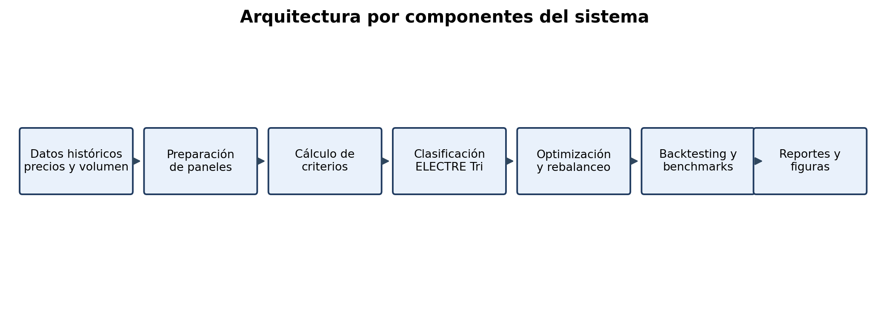

**Figura 11.** Diagrama de componentes del sistema propuesto. Fuente: elaboración propia.

Esta organización permite identificar con claridad dónde se ubica cada responsabilidad del sistema. La preparación de datos antecede al cálculo de criterios; la clasificación ELECTRE no asigna pesos, sino que define elegibilidad; y la optimización se ejecuta únicamente después de la reducción del universo. Esta separación es importante porque evita confundir la función de ELECTRE Tri con una técnica de optimización de portafolios, manteniendo la coherencia metodológica con la literatura de clasificación multicriterio.

## 7.4 Diagrama de casos de uso

Los casos de uso principales se concentran en tres actores: investigador, evaluador académico y usuario técnico. El investigador ejecuta el sistema y analiza resultados; el evaluador revisa la trazabilidad metodológica; y el usuario técnico replica o extiende la herramienta. La Figura 12 resume estas interacciones.

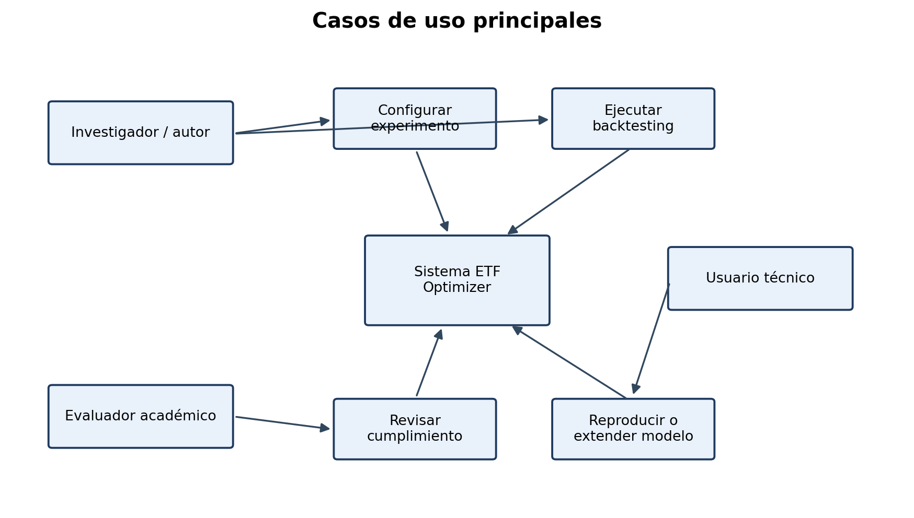

**Figura 12.** Casos de uso principales del sistema. Fuente: elaboración propia.

La interacción más importante desde el punto de vista académico es la revisión del evaluador, pues el sistema debe permitir verificar si las afirmaciones del documento se encuentran respaldadas por archivos de resultados, pruebas y reportes. Por esta razón, el diseño prioriza salidas auditables sobre una interfaz visual compleja.

## 7.5 Diagrama de actividades o flujo principal

El flujo principal del sistema representa la secuencia metodológica seguida en cada experimento. La ejecución inicia con datos históricos y finaliza con reportes de desempeño y cumplimiento de objetivos. Esta secuencia es fundamental para evitar sesgo de anticipación, dado que cada fecha de rebalanceo debe usar únicamente información disponible hasta ese momento.

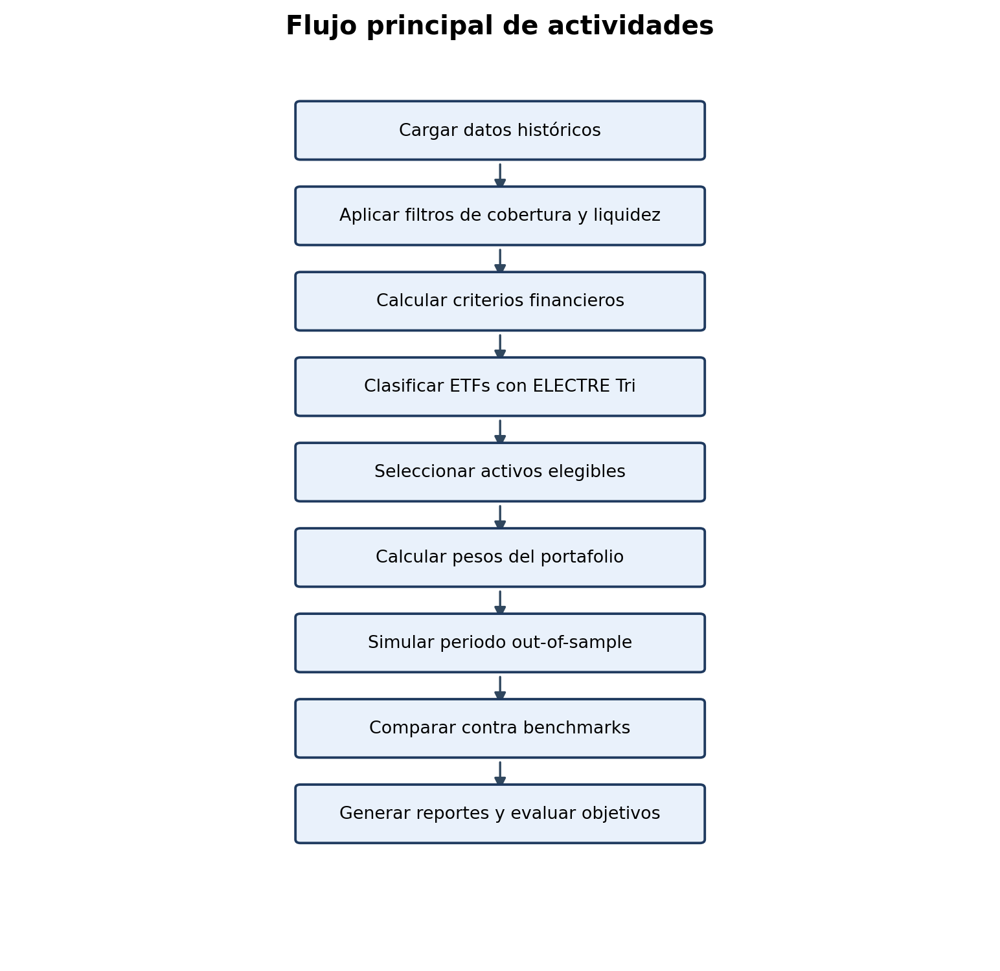

**Figura 13.** Flujo principal de actividades del sistema. Fuente: elaboración propia.

El flujo también evidencia que la validación no se reduce a calcular rentabilidades finales. Cada experimento produce métricas de desempeño, diagnósticos de clasificación, cardinalidad de selección, comparación contra benchmarks y un resumen de cumplimiento de objetivos, de modo que la evaluación final incorpora tanto criterios financieros como criterios de consistencia metodológica.

## 7.6 Diseño de base de datos

El sistema no implementa una base de datos relacional transaccional, sino una organización de datos analíticos basada en archivos tabulares y paneles históricos. Los precios y volúmenes se almacenan en formato Parquet, lo cual permite lectura eficiente y conservación de series temporales. Los resultados se guardan en archivos CSV y JSON, facilitando auditoría, visualización y generación de reportes.

## 7.7 Modelo entidad-relación

Aunque el sistema no utiliza una base de datos relacional, sí trabaja con entidades lógicas que pueden representarse mediante un modelo conceptual. Este modelo ayuda a comprender cómo se relacionan los datos de mercado, los criterios calculados, las decisiones de clasificación y los resultados de portafolio.

**Tabla 8**  
*Modelo conceptual de entidades del sistema*

| Entidad | Descripción | Relación principal |
|---|---|---|
| ETF | Instrumento financiero evaluado por el sistema | Tiene precios, volumen, criterios y categoría ELECTRE |
| Precio diario | Valor de cierre usado para calcular retornos | Pertenece a un ETF y a una fecha |
| Volumen diario | Actividad negociada usada como proxy de liquidez | Pertenece a un ETF y a una fecha |
| Criterio financiero | Indicador calculado para evaluar una alternativa | Se calcula para cada ETF en una ventana temporal |
| Categoría ELECTRE | Clasificación ordinal de elegibilidad | Se asigna a un ETF en cada rebalanceo |
| Portafolio | Conjunto de ETFs con pesos asignados | Se construye desde activos elegibles |
| Rebalanceo | Fecha de actualización de selección y pesos | Produce una composición de portafolio |
| Estrategia | Regla de asignación de pesos | Genera retornos simulados |
| Benchmark | Estrategia de comparación externa o interna | Permite evaluar desempeño relativo |

**Nota.** El modelo conceptual no implica persistencia SQL; representa la semántica de los archivos analíticos utilizados por el proyecto. Fuente: elaboración propia.

## 7.8 Diseño de interfaces principales

El proyecto se orienta a una interfaz de línea de comandos y generación de reportes, no a una interfaz gráfica de usuario. Las interfaces principales corresponden a scripts reproducibles que reciben parámetros de universo, fechas, frecuencia de rebalanceo, costos y ruta de salida. Esta decisión favorece replicabilidad académica y automatización de experimentos.

## 7.9 Diseño de roles, permisos y seguridad

Dado que el sistema no administra usuarios finales ni ejecuta operaciones financieras reales, los aspectos de roles y permisos se concentran en el control del repositorio, integridad de datos y reproducibilidad de experimentos. La seguridad principal consiste en evitar modificaciones no trazadas de los datos y mantener separación entre entradas, configuraciones, código y resultados.

# 8. Implementación

## 8.1 Entorno de desarrollo

El entorno de desarrollo se basa en Python y administración reproducible de dependencias mediante `uv`. El código se organiza en módulos bajo `src/etf_optimizer`, mientras que los experimentos se ejecutan desde scripts ubicados en `scripts`. Los resultados se almacenan en carpetas específicas bajo `results`, y las figuras finales se generan en `docs/figures/thesis_results`.

## 8.2 Tecnologías utilizadas

Las principales tecnologías utilizadas son Python, pandas, NumPy, SciPy, Matplotlib, pytest, Parquet y Git. Python actúa como lenguaje central de implementación; pandas y NumPy soportan el análisis de datos; SciPy permite resolver problemas de optimización; Matplotlib genera visualizaciones; pytest valida funcionalidad; Parquet permite almacenamiento eficiente de datos; y Git proporciona trazabilidad del desarrollo.

## 8.3 Estructura general del proyecto

La estructura general del proyecto separa código fuente, scripts, configuraciones, documentación, datos y resultados. Esta organización permite distinguir entre implementación del modelo, ejecución experimental y evidencia documental. Entre los archivos más relevantes se encuentran `src/etf_optimizer/features.py`, `src/etf_optimizer/pipeline.py`, `src/etf_optimizer/thesis_alignment.py`, `src/etf_optimizer/thesis_validation.py`, `scripts/run_sprint_experiment.py`, `scripts/build_thesis_compliance_artifacts.py` y `scripts/build_thesis_result_figures.py`.

## 8.4 Implementación de módulos principales

El módulo de características calcula indicadores financieros a partir de series históricas. El módulo de clasificación aplica ELECTRE Tri para asignar categorías ordinales. El pipeline integra selección, optimización y validación. El módulo de reportes genera evidencias metodológicas y diagnósticos de cumplimiento. Finalmente, los scripts de figuras convierten resultados cuantitativos en visualizaciones listas para el documento final.

## 8.5 Implementación de base de datos

La implementación de datos se realiza mediante archivos Parquet y CSV. A partir de `data/universe_master/price_ohlcv.parquet`, se generaron paneles derivados de cierre y volumen: `data/universe_master/derived_panels/close.parquet` y `data/universe_master/derived_panels/volume.parquet`. Estos paneles contienen 296 tickers y 2765 fechas, con cobertura desde 2015-01-02 hasta 2025-12-30.

## 8.6 Implementación de autenticación y autorización

No aplica autenticación de usuarios finales, debido a que el sistema se ejecuta localmente como herramienta de investigación. En la versión final se recomienda explicar que el alcance del proyecto no incluye una aplicación web multiusuario ni gestión de credenciales.

## 8.7 Evidencias principales del sistema desarrollado

Las evidencias principales incluyen la suite de pruebas automatizadas con 198 pruebas aprobadas, los resultados del protocolo principal 2021-2025, los resultados de la validación extendida 2015-2025, los diagnósticos ELECTRE, los reportes de cumplimiento de objetivos y las figuras generadas automáticamente. Estas evidencias permiten demostrar que el sistema fue implementado, ejecutado y evaluado bajo un protocolo documentado.

# 9. Pruebas y validación

## 9.1 Estrategia de pruebas

La estrategia de pruebas combina validación automatizada del código con validación empírica del modelo financiero. Las pruebas automatizadas verifican componentes funcionales del sistema, mientras que la validación empírica evalúa el comportamiento de las estrategias construidas frente a benchmarks. Esta doble aproximación es necesaria porque un sistema puede funcionar correctamente desde el punto de vista computacional, pero producir resultados financieros que no validen la hipótesis de desempeño.

## 9.2 Casos de prueba principales

Los casos de prueba principales cubren cálculo de características, reglas de selección, ejecución de pipeline, reportes de metodología y generación de artefactos de validación. La ejecución completa de la suite mediante `uv run pytest` reportó 198 pruebas aprobadas, lo que proporciona evidencia de estabilidad funcional del sistema al momento de elaboración de esta versión de trabajo.

## 9.3 Pruebas funcionales

Las pruebas funcionales verifican que el sistema pueda cargar datos, calcular indicadores, ejecutar clasificación ELECTRE, construir portafolios, aplicar rebalanceo y generar salidas. Estas pruebas se complementan con la ejecución de experimentos completos, donde el pipeline produce métricas, curvas de capital, drawdowns, diagnósticos y reportes de cumplimiento.

## 9.4 Pruebas no funcionales básicas

Las pruebas no funcionales se concentran en reproducibilidad, trazabilidad y claridad de resultados. El sistema conserva comandos de ejecución, rutas de entrada, parámetros de validación y archivos de salida, permitiendo reconstruir los experimentos. Además, el uso de formatos abiertos como CSV, JSON, Markdown y PNG/PDF facilita la revisión académica.

## 9.5 Validación con usuarios o experto del área

La validación disponible para este documento corresponde a una validación técnica y metodológica basada en evidencia reproducible, no a una prueba formal con usuarios finales de inversión. Esta decisión es coherente con el alcance del proyecto, dado que el sistema se orienta a investigación académica y no a una plataforma comercial de asesoría financiera. La validación se apoya en cuatro elementos: ejecución de pruebas automatizadas, generación de resultados experimentales, comparación frente a benchmarks y revisión de cumplimiento de objetivos.

El instrumento de validación utilizado se documenta en `docs/anexo_validacion_metodologica.md`, donde se registra la evidencia revisada, los resultados técnicos y las brechas observadas. En caso de que la versión institucional final requiera un acta firmada por experto, esta deberá incorporarse como anexo adicional; sin embargo, para efectos de esta versión de trabajo, la validación se presenta de manera honesta como revisión técnica-documental. Esta aclaración evita atribuir al proyecto una validación externa que no ha sido formalmente realizada y mantiene consistencia con los principios de trazabilidad del trabajo.

## 9.6 Resultados de las pruebas

Los resultados de validación muestran que el sistema funciona y produce reportes consistentes, pero también evidencian brechas respecto a los objetivos aceptados. En particular, la selección ELECTRE no mantiene de forma consistente la cardinalidad de 10 a 25 activos, y los criterios tracking error y expense ratio no se encuentran completamente cubiertos en las corridas finales. Estas observaciones son relevantes porque muestran que la validación no fue usada únicamente para confirmar resultados esperados, sino también para identificar límites operacionales del sistema.

## 9.7 Correcciones realizadas

Durante el desarrollo se incorporaron mejoras de trazabilidad, reportes de cumplimiento, diagnósticos de clasificación y generación de figuras. También se ajustó la lectura metodológica para evitar declarar como validado un objetivo que los resultados no respaldan. Esta corrección es especialmente importante para el tercer objetivo específico, pues la evidencia empírica disponible no muestra superioridad ajustada por riesgo frente a SPY ni frente al portafolio 60/40.

# 10. Resultados

## 10.1 Producto desarrollado

El producto desarrollado corresponde a un sistema reproducible de selección, optimización y validación de portafolios de ETFs mediante análisis multicriterio. El sistema permite ejecutar experimentos walk-forward, comparar estrategias y generar reportes de cumplimiento. Además, se construyó una arquitectura de documentación que relaciona objetivos, evidencia, brechas y resultados, lo cual fortalece la trazabilidad académica del proyecto.

## 10.2 Funcionalidades entregadas

Entre las funcionalidades entregadas se encuentran cálculo de indicadores financieros, clasificación ELECTRE Tri, selección de activos, estrategias de asignación EqualWeight, Minimum Variance y MaxSharpe, backtesting con rebalanceo, comparación contra benchmarks, generación de diagnósticos ELECTRE, reportes de calidad de datos, resumen de cumplimiento de objetivos y generación de figuras para tesis.

## 10.3 Cumplimiento de los objetivos específicos

El cumplimiento de objetivos es parcial y debe presentarse con transparencia. El primer objetivo específico no se cumple operacionalmente en las corridas actuales, debido a que la selección promedio por rebalanceo fue de 4,43 activos en el protocolo principal y 5,29 activos en la validación extendida, por debajo del rango objetivo de 10 a 25. El segundo objetivo específico se cumple parcialmente, ya que existe análisis de desempeño por categoría y señal ordinal en la corrida principal, aunque la robustez extendida es limitada. El tercer objetivo específico no se valida empíricamente, pues las estrategias ELECTRE no superan a SPY ni al portafolio 60/40 en las métricas principales.

## 10.4 Comparación entre la situación inicial y la solución propuesta

La situación inicial se caracterizaba por la ausencia de un pipeline integrado que conectara selección multicriterio, optimización y validación de ETFs. La solución propuesta entrega una herramienta funcional que permite realizar dicha integración, generar evidencia reproducible y diagnosticar límites de desempeño. Aunque los resultados financieros no demuestran superioridad frente a benchmarks, el proyecto sí transforma un problema de selección subjetiva en un proceso sistemático, auditable y extensible.

## 10.5 Limitaciones del producto final

Las limitaciones principales son la ausencia completa de tracking error y expense ratio en las corridas finales, el uso de un universo público aproximado point-in-time, la selección por rebalanceo inferior al rango objetivo, la falta de superioridad empírica frente a benchmarks y la ausencia de una validación formal con usuarios externos. Estas limitaciones deben entenderse como oportunidades de mejora para trabajo futuro, no como elementos que deban ocultarse en la presentación final.

## 10.6 Resultados cuantitativos del protocolo principal

**Tabla 4**  
*Resultados principales del protocolo 2021-2025*

| Estrategia | CAGR | Sharpe Ratio | Máximo drawdown | Interpretación |
|---|---:|---:|---:|---|
| ELECTRE EqualWeight | 12,88% | 1,198 | -7,54% | Resultado positivo, pero inferior a SPY y 60/40 en desempeño ajustado por riesgo |
| ELECTRE MinVariance | 12,47% | 1,236 | -6,56% | Mejora drawdown frente a ELECTRE EqualWeight, pero no supera benchmarks principales |
| ELECTRE MaxSharpe | 10,97% | 1,034 | -7,62% | Variante inferior dentro de las estrategias ELECTRE |
| SPY buy-and-hold | 23,32% | 1,932 | -7,58% | Benchmark dominante en CAGR y Sharpe Ratio |
| 60/40 SPY/BND | 15,85% | 1,964 | -3,80% | Supera a ELECTRE en Sharpe y control de drawdown |
| Universe EqualWeight | 11,98% | 1,695 | -3,48% | Menor CAGR que ELECTRE EqualWeight, pero mejor Sharpe y drawdown |

**Nota.** Métricas calculadas a partir de `results/thesis_primary_2021_2025_run_no_cap/strategy_comparison.csv`. Fuente: elaboración propia.

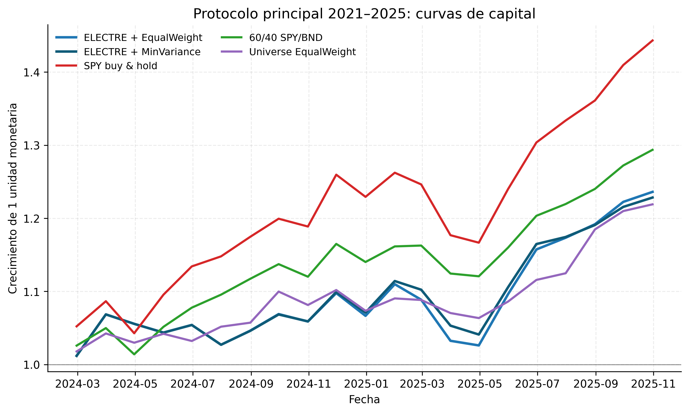

**Figura 1.** Curvas de capital del protocolo principal 2021-2025. Fuente: elaboración propia.

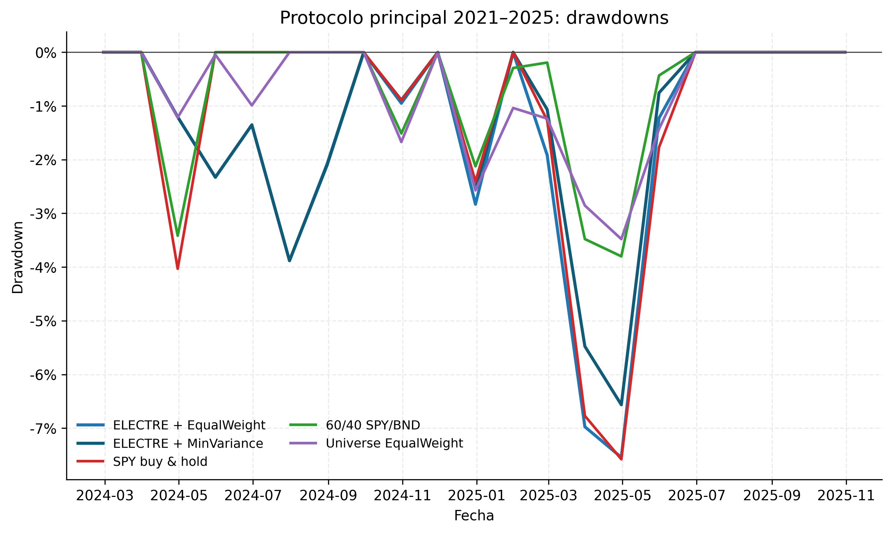

**Figura 2.** Drawdowns del protocolo principal 2021-2025. Fuente: elaboración propia.

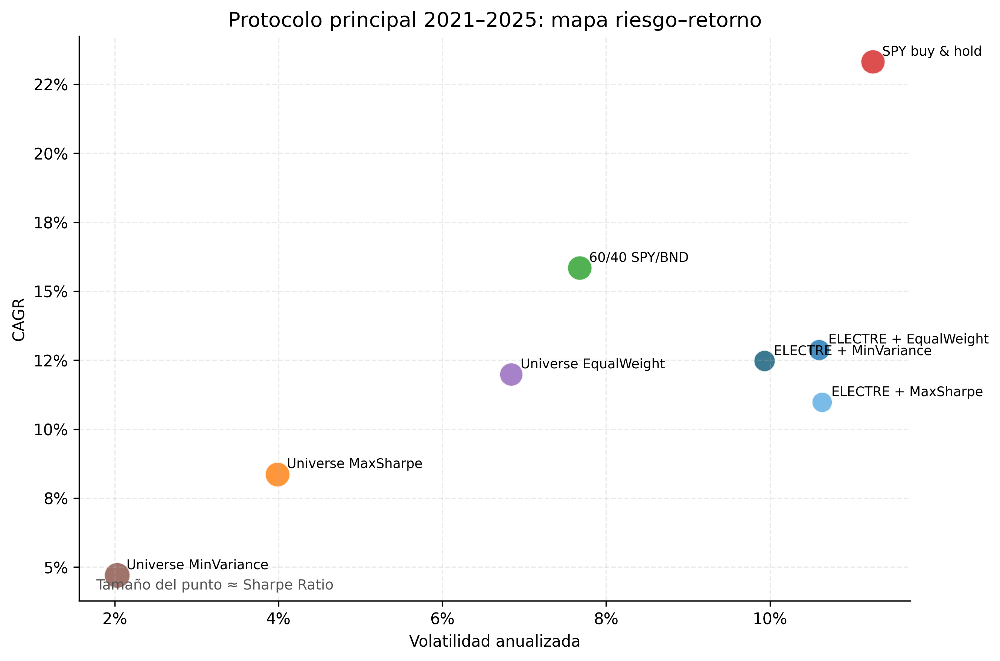

**Figura 3.** Relación riesgo-retorno de las estrategias evaluadas en el protocolo principal. Fuente: elaboración propia.

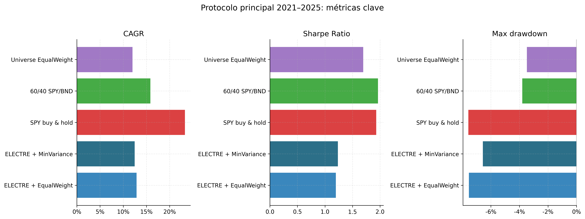

**Figura 4.** Comparación de CAGR, Sharpe Ratio y máximo drawdown en el protocolo principal. Fuente: elaboración propia.

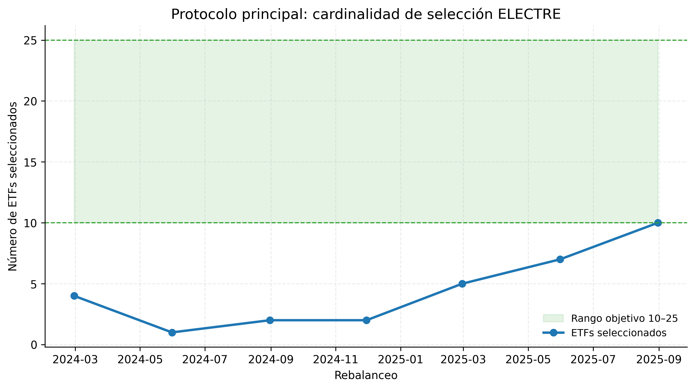

**Figura 5.** Cardinalidad de la selección ELECTRE por fecha de rebalanceo. Fuente: elaboración propia.

## 10.7 Resultados de robustez 2015-2025

**Tabla 5**  
*Resultados de la validación extendida 2015-2025*

| Estrategia | CAGR | Sharpe Ratio | Máximo drawdown | Interpretación |
|---|---:|---:|---:|---|
| ELECTRE EqualWeight | 3,78% | 0,332 | -20,45% | Resultado positivo, pero débil frente a benchmarks |
| ELECTRE MinVariance | 3,40% | 0,320 | -20,23% | Similar a ELECTRE EqualWeight |
| ELECTRE MaxSharpe | 2,67% | 0,257 | -21,06% | Variante inferior |
| SPY buy-and-hold | 13,85% | 0,867 | -23,93% | Superior en CAGR y Sharpe |
| 60/40 SPY/BND | 9,16% | 0,844 | -20,26% | Supera claramente a ELECTRE |
| Universe EqualWeight | 6,36% | 0,583 | -18,57% | Supera a ELECTRE, indicando que la selección actual no agrega valor neto robusto |

**Nota.** Métricas calculadas a partir de `results/thesis_extended_2015_2025_run_no_cap/strategy_comparison.csv`. Fuente: elaboración propia.

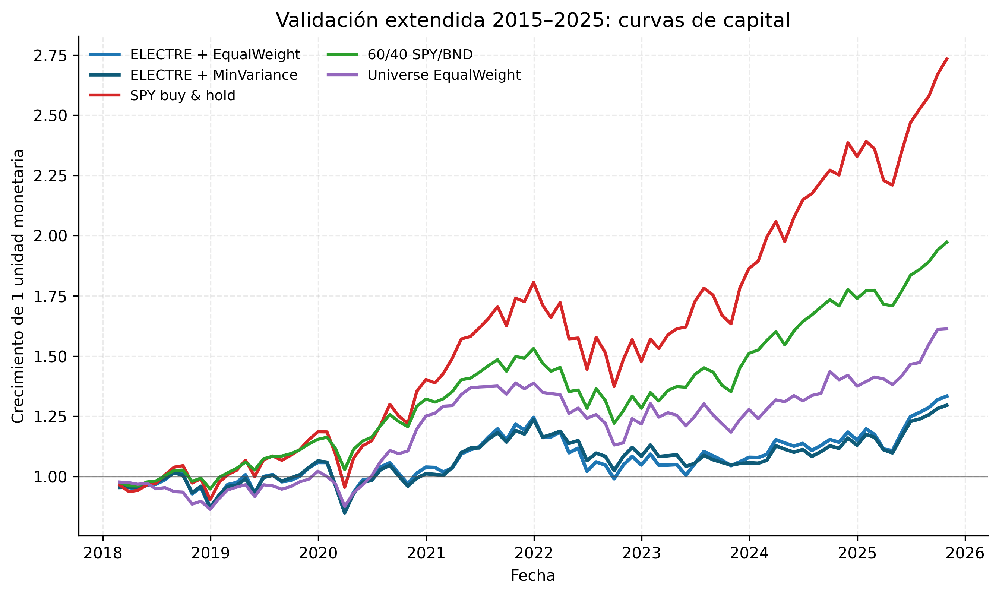

**Figura 6.** Curvas de capital de la validación extendida 2015-2025. Fuente: elaboración propia.

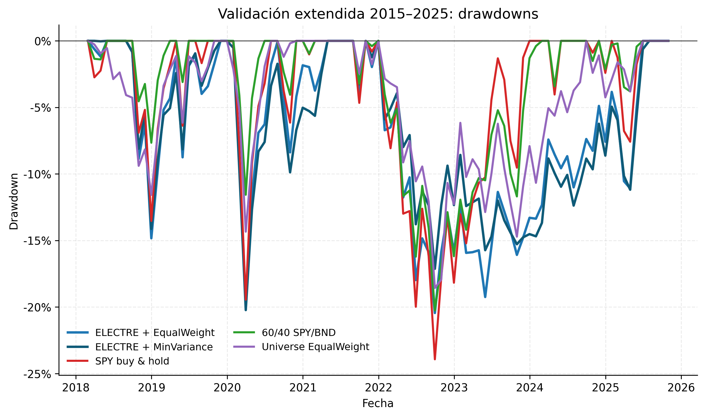

**Figura 7.** Drawdowns de la validación extendida 2015-2025. Fuente: elaboración propia.

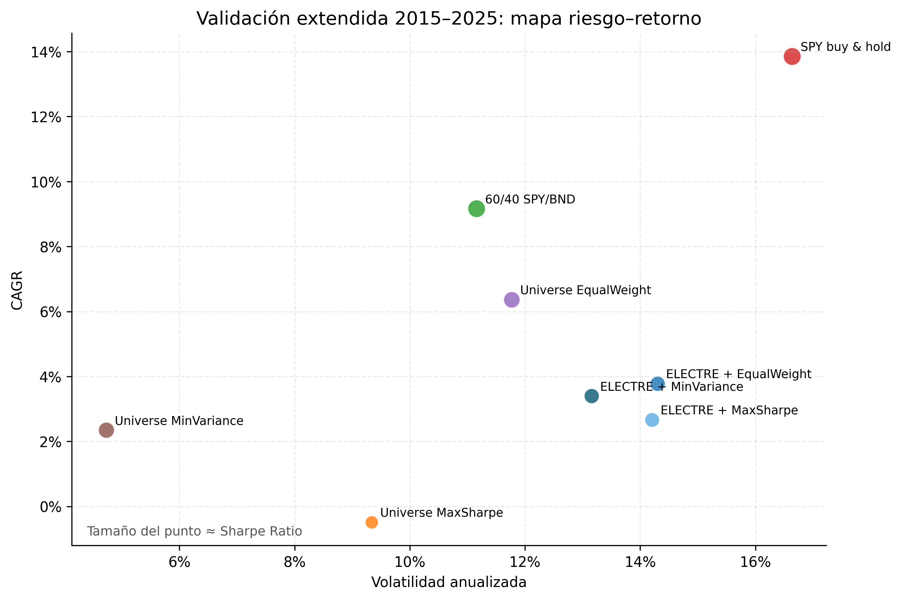

**Figura 8.** Relación riesgo-retorno de las estrategias evaluadas en la validación extendida. Fuente: elaboración propia.

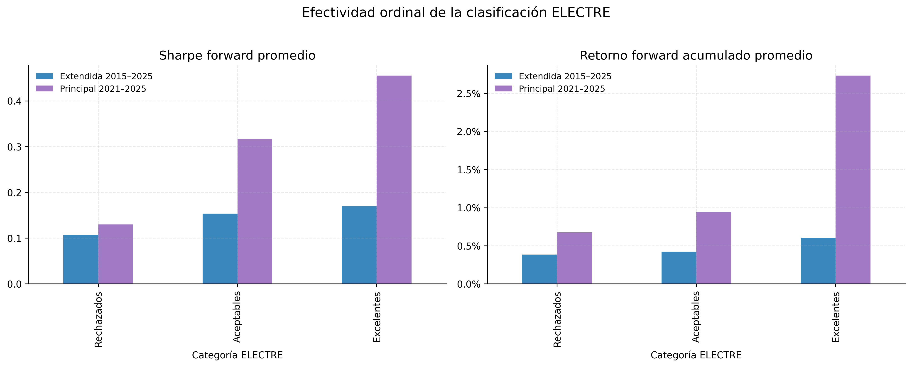

**Figura 9.** Efectividad ordinal de la clasificación ELECTRE por categoría. Fuente: elaboración propia.

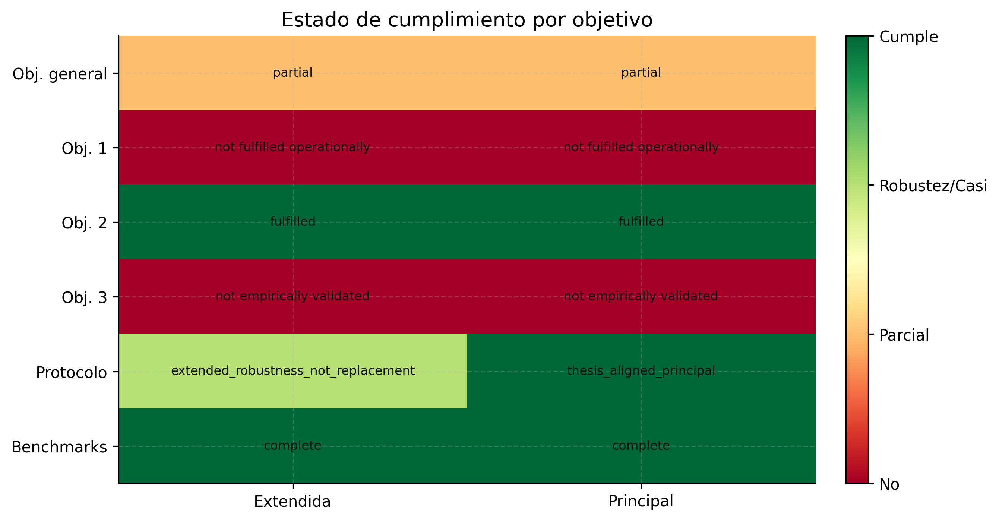

**Figura 10.** Cumplimiento de objetivos del trabajo de grado según evidencia empírica disponible. Fuente: elaboración propia.

# 11. Conclusiones y trabajo futuro

## 11.1 Conclusiones generales

El proyecto permitió desarrollar e implementar un sistema integrado para selección, optimización y validación de portafolios de ETFs mediante análisis multicriterio. La principal contribución se encuentra en la construcción de un pipeline reproducible que conecta criterios financieros, clasificación ELECTRE Tri, asignación de pesos, rebalanceo y comparación frente a benchmarks. Esta integración proporciona una base metodológica útil para estudiar decisiones de inversión en ETFs desde una perspectiva sistemática y trazable.

Sin embargo, los resultados empíricos muestran que la implementación actual no valida una superioridad ajustada por riesgo frente a estrategias tradicionales. En el protocolo principal, SPY y el portafolio 60/40 superan a las estrategias ELECTRE en Sharpe Ratio, mientras que en la validación extendida el desempeño de ELECTRE se debilita de manera significativa. Por lo tanto, la tesis debe concluir que el modelo es valioso como herramienta metodológica y de investigación aplicada, pero que requiere mejoras en datos, cardinalidad y configuración de clasificación antes de sostener claims de desempeño superior.

## 11.2 Conclusiones por objetivo específico

Respecto al primer objetivo específico, se diseñó e implementó un sistema de clasificación multicriterio, pero la reducción operacional al rango de 10 a 25 activos no se mantuvo de forma consistente en las corridas finales. Respecto al segundo objetivo, se analizaron indicadores financieros y diagnósticos de clasificación, encontrando evidencia parcial de consistencia ordinal, especialmente en el protocolo principal. Respecto al tercer objetivo, se implementaron estrategias de optimización y validación, pero la evidencia no confirmó que el enfoque multicriterio generara mejores rentabilidades ajustadas por riesgo que los benchmarks tradicionales.

## 11.3 Recomendaciones

Se recomienda completar la integración de tracking error y expense ratio con fuentes de datos confiables, activar una regla final de cardinalidad que garantice entre 10 y 25 activos por rebalanceo, fortalecer los peer groups de clasificación ELECTRE, mejorar la factibilidad de restricciones de exposición y ampliar la validación con un universo regulatorio enriquecido. También se recomienda mantener una separación clara entre resultados principales 2021-2025 y robustez extendida 2015-2025, evitando usar esta última como reemplazo del protocolo aceptado.

## 11.4 Trabajo futuro

El trabajo futuro puede orientarse hacia una arquitectura de datos regulatoria que integre fuentes como SEC N-PORT, N-CEN, EDGAR, OpenFIGI y metadatos de emisores. También puede explorarse la incorporación de nuevos criterios como spreads bid-ask, activos bajo administración, concentración sectorial, eficiencia fiscal y sostenibilidad. Desde el punto de vista metodológico, se pueden evaluar variantes de ELECTRE, PROMETHEE, TOPSIS o modelos híbridos, así como técnicas robustas de optimización que reduzcan sensibilidad a errores de estimación.

# 12. Referencias bibliográficas

Las referencias se presentan en formato APA 7 con la información bibliográfica disponible en el documento base y en los materiales del proyecto. Cuando la fuente original consultada no incluye volumen, número, páginas o editorial, se conserva la referencia sin inventar metadatos adicionales.

Albadvi, A., Chaharsooghi, S. K., & Esfahanipour, A. (2006). Decision making in stock trading: An application of PROMETHEE. *European Journal of Operational Research, 177*(2), 673-683. https://doi.org/10.1016/j.ejor.2005.11.022

Ballestero, E., Bravo, M., Pérez-Gladish, B., Arenas-Parra, M., & Plà-Santamaria, D. (2012). Socially responsible investment: A multicriteria approach to portfolio selection combining ethical and financial objectives. *European Journal of Operational Research, 216*(2), 487-494. https://doi.org/10.1016/j.ejor.2011.07.011

Bányai, T., et al. (2024). The impact of rebalancing strategies on ETF portfolio performance.

Black, F., & Litterman, R. (1992). Global portfolio optimization. *Financial Analysts Journal*.

Brans, J. P., & Vincke, P. (1985). A preference ranking organisation method. *Management Science*.

Brans, J. P., & Mareschal, B. (2005). PROMETHEE methods. En J. Figueira, S. Greco, & M. Ehrgott (Eds.), *Multiple criteria decision analysis: State of the art surveys*.

Cohen, S., & Del Valle, J. (2025). Decoding active ETFs.

DeMiguel, V., Garlappi, L., & Uppal, R. (2009). Optimal versus naive diversification: How inefficient is the 1/N portfolio strategy? *The Review of Financial Studies*.

Elton, E. J., Gruber, M. J., Brown, S. J., & Goetzmann, W. N. (2014). *Modern portfolio theory and investment analysis*.

Hwang, C.-L., & Yoon, K. (1981). *Methods for multiple attribute decision making*.

Investment Company Institute. (2025). ETF market statistics and investment company factbook data.

Jaffri, A. A., et al. (2025). Optimizing portfolios with Pakistan-exposed exchange-traded funds: Risk and performance insight.

Khan, S., & Khan, U. (2024). The dynamic influence of uncertainty on sector equity funds: A time-frequency analysis of oil, gold, and market volatility.

Khomyn, M., Putniņš, T. J., & Zoican, M. A. (2024). The value of ETF liquidity.

Kritzman, M., Page, S., & Turkington, D. (2010). In defense of optimization: The fallacy of 1/N.

López de Prado, M. (2016). Building diversified portfolios that outperform out of sample.

Markowitz, H. (1952). Portfolio selection. *The Journal of Finance*.

Markowitz, H. (1959). *Portfolio selection: Efficient diversification of investments*.

Michaud, R. O. (1998). *Efficient asset management*.

Pendaraki, K., Zopounidis, C., & Doumpos, M. (2005). On the construction of mutual fund portfolios: A multicriteria methodology and an application to the Greek market of equity mutual funds.

Roy, B. (1968). Classement et choix en présence de points de vue multiples: La méthode ELECTRE.

Roy, B. (1993). Decision science or decision-aid science? *European Journal of Operational Research*.

Roy, B., & Bouyssou, D. (1993). *Aide multicritère à la décision: Méthodes et cas*.

Saaty, T. L. (1980). *The analytic hierarchy process*.

Samaras, G. D., Matsatsinis, N. F., & Zopounidis, C. (2003). A multicriteria DSS for a global stock evaluation.

Sharpe, W. F. (1964). Capital asset prices: A theory of market equilibrium under conditions of risk. *The Journal of Finance*.

Spronk, J., Steuer, R. E., & Zopounidis, C. (2005). Multicriteria decision aid/analysis in finance.

Steuer, R. E., & Na, P. (2003). Multiple criteria decision making combined with finance: A categorized bibliographic study.

Tiryaki, F., & Ahlatcioglu, B. (2009). Fuzzy portfolio selection using fuzzy analytic hierarchy process.

Tsalikis, E., & Papadopoulos, S. (2019). ETFs: Performance, tracking errors and their determinants in Europe and the USA.

Vuorela, T. (2024). Assessing the impact of AI-managed ETFs on investment performance and risk compared to benchmark index.

Xidonas, P., Mavrotas, G., & Psarras, J. (2009). A multicriteria methodology for equity selection using financial analysis.

Zopounidis, C., & Doumpos, M. (2013). Multicriteria decision systems for financial problems.

# 13. Anexos

## 13.1 Enlace al repositorio del proyecto

El repositorio de trabajo se encuentra disponible localmente en la ruta `portfolio-etf-optimizer`. Al momento de esta versión no se registra un remoto Git público configurado, por lo cual la versión institucional final debe reemplazar esta ruta por el enlace autorizado del repositorio cuando sea publicado. Para fines de reproducibilidad interna, la estructura del proyecto conserva código fuente, datos procesados, resultados experimentales, documentación y scripts de generación.

## 13.2 Enlace al manual de usuario

El manual de usuario se incluye en `docs/manual_usuario_tesis.md`. Este documento describe los requisitos mínimos, comandos de ejecución del protocolo principal, comandos de validación extendida, generación de figuras y descripción de las salidas más importantes. Su propósito es permitir que un lector académico reproduzca los experimentos sin modificar el código fuente.

## 13.3 Enlace al manual técnico

El manual técnico se incluye en `docs/manual_tecnico_tesis.md`. Allí se documentan la arquitectura general, módulos principales, estructura de datos, comandos de validación técnica, decisiones de diseño y limitaciones técnicas identificadas durante el desarrollo. Este manual complementa el Capítulo 8 y permite revisar el sistema desde una perspectiva de ingeniería de software.

## 13.4 Instrumentos usados

El instrumento usado corresponde a una validación metodológica documentada en `docs/anexo_validacion_metodologica.md`. Este anexo registra evidencia técnica, pruebas automatizadas, rutas de resultados, figuras generadas y brechas de cumplimiento. No se presenta como acta firmada de usuario externo, sino como instrumento de revisión técnica y documental del proyecto.

## 13.5 Capturas adicionales

No se incluyen capturas adicionales dentro del documento principal, dado que las evidencias más relevantes corresponden a figuras analíticas generadas automáticamente, tablas de resultados y archivos reproducibles. Esta decisión evita ocupar espacio con capturas de pantalla de bajo valor metodológico y prioriza visualizaciones directamente vinculadas con los objetivos del trabajo de grado.
